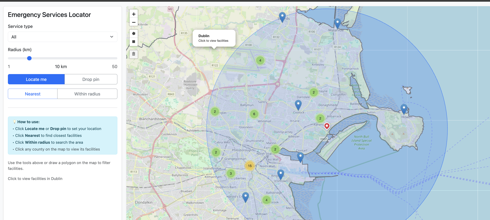
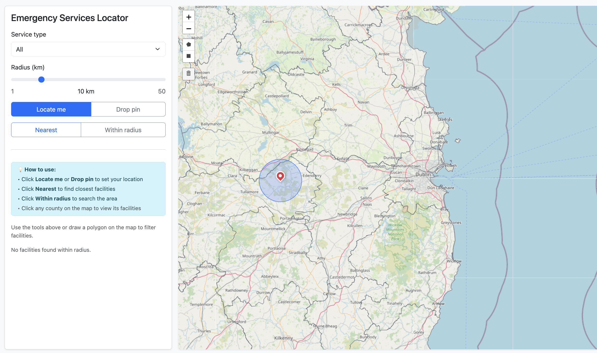

# Emergency Services Locator

> A production-ready web mapping application for discovering and analyzing emergency services across Ireland using interactive spatial queries.


---

## 📋 Table of Contents

- [Overview](#overview)
- [Features](#features)
- [Screenshots](#screenshots)
- [Technology Stack](#technology-stack)
- [Prerequisites](#prerequisites)
- [Quick Start (Docker)](#quick-start-docker)
- [Local Development Setup](#local-development-setup)
- [API Documentation](#api-documentation)
- [Data Import](#data-import)
- [Testing](#testing)
- [Deployment](#deployment)
- [Known Issues & Limitations](#known-issues--limitations)
- [Contributing](#contributing)
- [License](#license)

---

## 📖 Overview

The **Emergency Services Locator** is a comprehensive geospatial web application designed to help users locate emergency services (hospitals, fire stations, police stations, ambulance services) across Ireland. Built with Django, PostGIS, and Leaflet, it provides powerful spatial query capabilities through an intuitive map-based interface.

### Key Capabilities

- **Interactive Map Interface**: Drag, zoom, and click to explore emergency services
- **Multiple Search Methods**: Find services by proximity, radius, county boundaries, or custom areas
- **Real-time Spatial Queries**: Optimized PostGIS queries for sub-second response times
- **RESTful API**: Complete API for integration with other systems
- **Responsive Design**: Works seamlessly on desktop, tablet, and mobile devices
- **Production Ready**: Dockerized deployment with nginx, PostgreSQL, and monitoring tools

---

## ✨ Features

### Core Functionality

- ✅ **Geolocation Support**: Find your current location and nearby services
- ✅ **Drop Pin Mode**: Place custom pins anywhere on the map to search from that location
- ✅ **Proximity Search**: Find the 5 nearest emergency services to any point
- ✅ **Radius Search**: Discover all services within a customizable radius (1-50km)
- ✅ **County Filtering**: View and search services within specific Irish counties
- ✅ **Service Type Filtering**: Filter by hospital, fire station, police, or ambulance
- ✅ **Interactive Popups**: Detailed information cards for each service location
- ✅ **Distance Calculations**: Real-time distance measurements from your location

### Advanced Features

- 🎯 **Draggable Pins**: Reposition search locations by dragging markers
- 🗺️ **County Boundary Overlays**: Toggle visibility of administrative boundaries
- 📊 **Dynamic Radius Visualization**: Visual circle overlays showing search areas
- 🔄 **Live Updates**: Results update dynamically as you adjust parameters
- 📱 **Fully Responsive**: Mobile-first design with touch-friendly controls
- 🚀 **High Performance**: Spatial indexes and query optimization for fast results

### Technical Features

- 🔒 **Secure API**: Token-based authentication for write operations
- 📦 **Docker Deployment**: Complete containerized stack with health checks
- 🗄️ **Spatial Database**: PostGIS for advanced geospatial operations
- 🔍 **RESTful API**: GeoJSON endpoints following REST best practices
- 📈 **Scalable Architecture**: Nginx reverse proxy with Gunicorn workers
- 🛠️ **Admin Interface**: Django admin panel for data management

---

## 📸 Screenshots

### Main Map Interface

*Interactive map with service markers, county boundaries, and control panel*

### Proximity Search

*Find the 5 nearest emergency services to any location*

### Radius Search

*Discover all services within a customizable radius*

### Drop Pin Mode

*Place custom pins anywhere on the map*

---

## 🛠️ Technology Stack

### Backend

| Technology | Version | Purpose |
|------------|---------|---------|
| **Python** | 3.10+ | Core programming language |
| **Django** | 5.0+ | Web framework and ORM |
| **Django REST Framework** | 3.15+ | RESTful API framework |
| **PostgreSQL** | 16 | Relational database |
| **PostGIS** | 3.4 | Spatial database extension |
| **GeoDjango** | Built-in | Django's geographic framework |
| **psycopg2** | 2.9+ | PostgreSQL adapter |
| **Gunicorn** | 21.0+ | WSGI HTTP server |

### Frontend

| Technology | Version | Purpose |
|------------|---------|---------|
| **Leaflet.js** | 1.9.x | Interactive mapping library |
| **Bootstrap** | 5.3.x | Responsive UI framework |
| **JavaScript (ES6+)** | Modern | Client-side interactivity |
| **HTML5** | - | Semantic markup |
| **CSS3** | - | Styling and animations |

### DevOps & Infrastructure

| Technology | Version | Purpose |
|------------|---------|---------|
| **Docker** | 20.10+ | Containerization |
| **Docker Compose** | 3.9+ | Multi-container orchestration |
| **Nginx** | Alpine | Reverse proxy & static files |
| **pgAdmin** | 8 | Database administration |

### Data & APIs

- **OpenStreetMap**: Base map tiles (Nominatim API)
- **GeoJSON**: Spatial data interchange format
- **Overpass API**: OpenStreetMap data queries (optional)

---

## 📋 Prerequisites

### For Docker Deployment (Recommended)

- **Docker**: Version 20.10 or higher
- **Docker Compose**: Version 2.0 or higher
- **Disk Space**: 2GB minimum
- **RAM**: 4GB minimum recommended

### For Local Development

- **Python**: 3.10 or higher
- **PostgreSQL**: 14+ with PostGIS extension
- **Git**: For version control
- **pip**: Python package manager
- **virtualenv**: Python virtual environment tool

---

## 🚀 Quick Start (Docker)

The fastest way to get the application running is using Docker Compose:

### 1. Clone the Repository

```bash
git clone https://github.com/yourusername/emergency-services-locator.git
cd emergency-services-locator
```

### 2. Configure Environment Variables

```bash
# Copy the example environment file
cp .env.example .env

# Edit .env with your preferred settings (optional)
# Default values work out of the box
nano .env
```

**Example `.env` file:**

```env
# Database Configuration
POSTGRES_USER=postgres
POSTGRES_PASSWORD=postgres
POSTGRES_DB=es_locator

# Django Settings
DJANGO_SECRET_KEY=your-secret-key-here
DJANGO_DEBUG=False
DJANGO_ALLOWED_HOSTS=localhost,127.0.0.1

# Gunicorn Configuration
WORKERS=3
TIMEOUT=60

# pgAdmin Configuration
PGADMIN_DEFAULT_EMAIL=admin@example.com
PGADMIN_DEFAULT_PASSWORD=admin123
```

### 3. Start the Application

```bash
# Build and start all containers
docker-compose up -d

# View logs (optional)
docker-compose logs -f
```

### 4. Initialize the Database

```bash
# Run database migrations
docker-compose exec web python manage.py migrate

# Import sample data
docker-compose exec web python manage.py import_counties
docker-compose exec web python manage.py import_facilities

# Create admin user
docker-compose exec web python manage.py createsuperuser
```

### 5. Access the Application

Open your browser and navigate to:

- **Main Application**: http://localhost/
- **Django Admin**: http://localhost/admin/
- **pgAdmin**: http://localhost:5050/

**That's it!** You're now running a full production-ready stack.

### Stopping the Application

```bash
# Stop containers (preserves data)
docker-compose down

# Stop and remove all data
docker-compose down -v
```

---

## 💻 Local Development Setup

For local development without Docker:

### 1. Install PostgreSQL with PostGIS

**macOS (using Homebrew):**
```bash
brew install postgresql@16 postgis
brew services start postgresql@16
```

**Ubuntu/Debian:**
```bash
sudo apt-get update
sudo apt-get install postgresql-16 postgresql-16-postgis-3 postgis
sudo systemctl start postgresql
```

### 2. Create Database

```bash
# Create database
createdb es_locator

# Enable PostGIS extension
psql -d es_locator -c "CREATE EXTENSION IF NOT EXISTS postgis;"
psql -d es_locator -c "CREATE EXTENSION IF NOT EXISTS pg_trgm;"
```

### 3. Set Up Python Environment

```bash
# Create virtual environment
python3 -m venv .venv

# Activate virtual environment
source .venv/bin/activate  # On Windows: .venv\Scripts\activate

# Install dependencies
pip install --upgrade pip
pip install -r requirements.txt
```

### 4. Configure Environment

```bash
# Create .env file
cp .env.example .env

# Edit with your database credentials
nano .env
```

**Example local `.env`:**
```env
DB_NAME=es_locator
DB_USER=your_username
DB_PASSWORD=your_password
DB_HOST=localhost
DB_PORT=5432
DJANGO_SECRET_KEY=your-secret-key-here
DJANGO_DEBUG=True
DJANGO_ALLOWED_HOSTS=localhost,127.0.0.1
```

### 5. Initialize Django

```bash
# Run migrations
python manage.py migrate

# Collect static files
python manage.py collectstatic --no-input

# Create superuser
python manage.py createsuperuser

# Import sample data
python manage.py import_counties
python manage.py import_facilities
```

### 6. Run Development Server

```bash
python manage.py runserver

# Application available at http://127.0.0.1:8000/
```

---

## 🌐 Deployment

### Docker Production Deployment

#### 1. Cloud Hosting Setup

**For AWS EC2:**
```bash
# Install Docker
sudo yum update -y
sudo yum install docker -y
sudo service docker start
sudo usermod -a -G docker ec2-user

# Install Docker Compose
sudo curl -L "https://github.com/docker/compose/releases/latest/download/docker-compose-$(uname -s)-$(uname -m)" -o /usr/local/bin/docker-compose
sudo chmod +x /usr/local/bin/docker-compose
```

**For DigitalOcean Droplet:**
```bash
# Use Docker pre-installed droplet or install manually
sudo apt-get update
sudo apt-get install docker.io docker-compose -y
```

#### 2. Clone and Configure

```bash
# Clone repository
git clone https://github.com/yourusername/emergency-services-locator.git
cd emergency-services-locator

# Set production environment variables
nano .env
```

**Production `.env` example:**
```env
POSTGRES_USER=postgres
POSTGRES_PASSWORD=STRONG_PASSWORD_HERE
POSTGRES_DB=es_locator
DJANGO_SECRET_KEY=GENERATE_STRONG_SECRET_KEY
DJANGO_DEBUG=False
DJANGO_ALLOWED_HOSTS=yourdomain.com,www.yourdomain.com
WORKERS=4
TIMEOUT=120
```

#### 3. Deploy

```bash
# Build and start
docker-compose up -d --build

# Initialize database
docker-compose exec web python manage.py migrate
docker-compose exec web python manage.py collectstatic --no-input
docker-compose exec web python manage.py createsuperuser
docker-compose exec web python manage.py import_counties
docker-compose exec web python manage.py import_facilities
```

#### 4. Configure Domain (Optional)

**nginx configuration** (`docker/nginx/nginx.conf`):
```nginx
server {
    listen 80;
    server_name yourdomain.com www.yourdomain.com;
    
    # Redirect to HTTPS (after SSL setup)
    # return 301 https://$server_name$request_uri;
    
    location /static/ {
        alias /staticfiles/;
    }
    
    location / {
        proxy_pass http://web:8000;
        proxy_set_header Host $host;
        proxy_set_header X-Real-IP $remote_addr;
        proxy_set_header X-Forwarded-For $proxy_add_x_forwarded_for;
        proxy_set_header X-Forwarded-Proto $scheme;
    }
}
```

#### 5. SSL Certificate (Let's Encrypt)

```bash
# Install certbot
sudo apt-get install certbot python3-certbot-nginx -y

# Obtain certificate
sudo certbot --nginx -d yourdomain.com -d www.yourdomain.com
```

### Platform-as-a-Service Deployment

The application can also be deployed to:

- **Heroku**: With Heroku Postgres and PostGIS buildpack
- **Railway**: Native Docker support
- **Render**: Supports Docker Compose
- **Google Cloud Run**: Containerized deployment
- **Azure App Service**: Container instances

---

